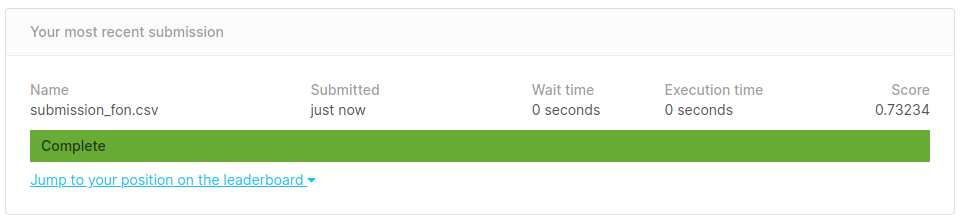

# Flight Delays

**Atividade 10 (Gradient Boosting)**: Vamos predizer quando um voo atrasará mais do que 15 minutos.

**Kaggle Challenge**: [Flight Delays Spring 2018](https://www.kaggle.com/c/flight-delays-spring-2018/data)

Instruções gerais:

1. Utilize as bases de treinamento e teste do desafio "Flight delays" do [Kaggle](https://www.kaggle.com/c/flight-delays-spring-2018/overview)
2. Aplique Gradient Boosting e alcance o maior resultado possível na base de testes, seguindo o processo que praticamos até agora na base de treino.
   - Utilize o roc_auc_score(y_test, y_pred) para avaliar o seu modelo
3. Em duplas, nota será normalizada:
   - 1 ponto: Implementação e avaliação na base de treinamento.
   - 1 ponto: Normalização do resultado na base de testes entre 0,5 a 0,72998 (kaggle - Leaderboard - Public);
   - 1 ponto extra: maior que 0,72998 na base de testes (kaggle - Leaderboard - Public), Mais um ponto extra!

Para obter o resultado na base de testes, é necessário submeter na competição.

**Submissão**:

  

## Requirements

For this exercise, you'll need to install `xgboost` to `tensorflow_notebook`. To do this, please follow the instruction mentioned in the [docs](https://github.com/lcbm/cs-machine-learning/tree/master#installing-new-packages).
